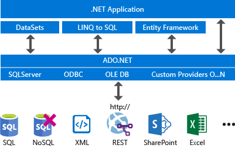


## Uj projekt létrehozása

[Itt ](https://learn.microsoft.com/en-us/visualstudio/ide/create-csharp-winform-visual-studio?toc=%2Fvisualstudio%2Fget-started%2Fcsharp%2Ftoc.json&bc=%2Fvisualstudio%2Fget-started%2Fcsharp%2Fbreadcrumb%2Ftoc.json&view=vs-2022) 
találtok részletes leírást hogyan tudtok létrehozni egy új Windows Forms alkalmazást, valamint nehány példát hogyan tudjátok az alkalmazást különböző elemekkel ellátni(gombok, bemeneti mezők stb.) 

### Adatbazis kapcsolat letrehozasa
Az adatbazis kapcsolatot az ADO.NET osztalyai segisegevel hozhatjuk letre. Az ADO.NET szerepe egy absztrakciós szintet biztositson a különböző adatforrások(állományok, adatbázisok, web szolgaltatasok stb.) egységes kezelésére

[Itt találtok több példát, viszont az SQL adatforrást kell használnunk az alkamazásunk esetén.](https://learn.microsoft.com/en-us/dotnet/framework/data/adonet/ado-net-code-examples )

## Példa projekt importálásának lépései

### 1.lépés
nyaralo_script.sql végrehajtása (létrejön az adatbázis s annak táblái és feltöltodnek adatokkal)

### 2. lépés
  Berlesek_pelda_2018 projekt megnyitása Visual Studio-val. 
  Ez tortenhet .sln(solution) kiterjesztesu allomany megnyitasaval vagy a Visual  Studio `File->Open` opciojaval

### 3.lépés
DALGen.cs fájlban a kapcsolati karakterlánc (strSqlConn) testreszabása. Ebben az allomanyban találtok példát és némi magyarázatot, hogy hogyan dolgozz az ADO.NET  

### 4.lépés
Program futtatása : Start

